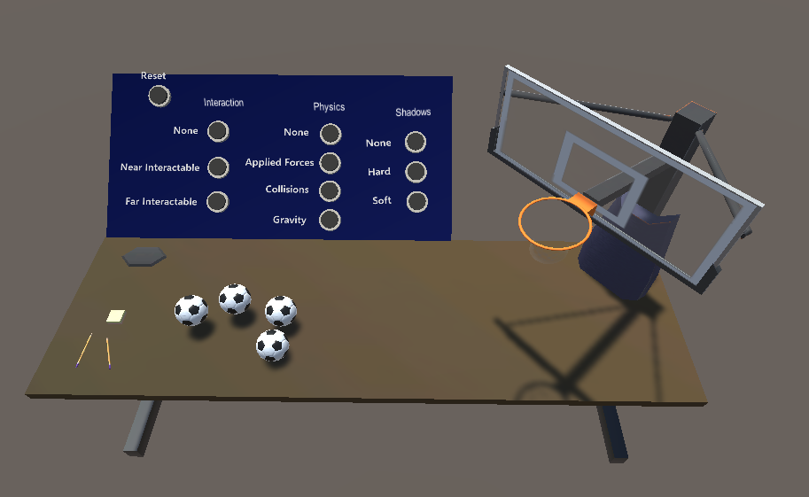

# AR_presence
 
Nishan Shehadeh's Master's Thesis on Presence in Augmented Reality

This repository is the Unity environment used in user study. It is a 3D testing environment with customizable levels of interaction, shadows, and physics. It saves transition state maps created by the study participant to a csv for further analysis.

Thesis: https://ir.vanderbilt.edu/handle/1803/18453
